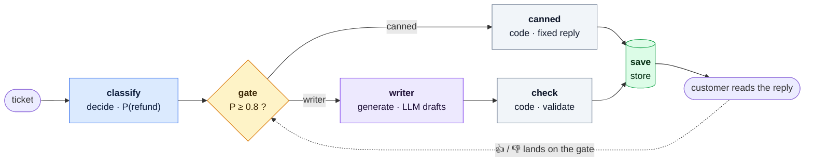
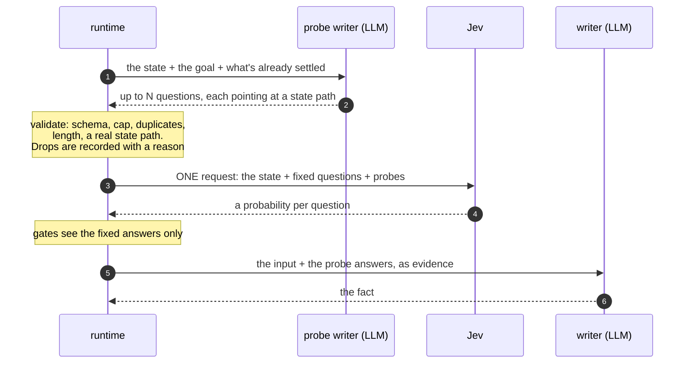
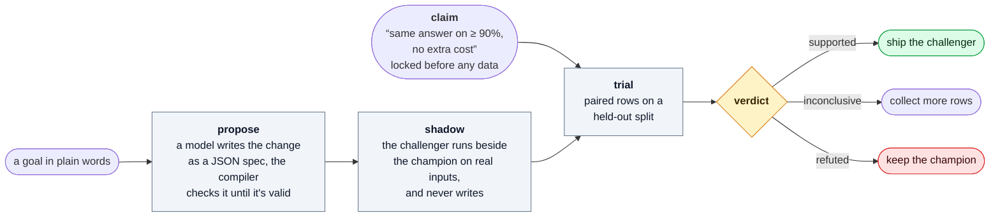
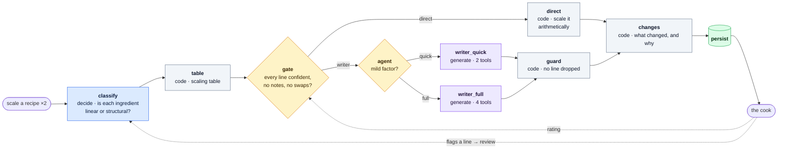

<h1 align="center">decision-pipeline</h1>

<p align="center">
  <b>Let models estimate. Let code decide. Let people correct it later.</b><br>
  A small TypeScript core for LLM features you can trace, tune and trust.
</p>

<p align="center">
  <a href="https://github.com/dipseth/decision-pipeline/actions/workflows/ci.yml"></a>
  <a href="LICENSE"></a>
  
  
</p>

<p align="center">
  
  &nbsp;
  
</p>

---

Most LLM features start life as a chain: ask a model, trust its answer, save it. That is hard to debug, hard to tune, and every request pays for the biggest model.

A **decision pipeline** is a small, declared graph that works differently:

- 🎲 **Models estimate.** A `decide` node asks a model for *probabilities* ("how likely is this a refund request?"), never for the answer itself. We use [Jev](#jev-llms-and-code-who-does-what), a calibrated evaluator built for exactly this.
- 🚦 **Code decides.** A **gate** is plain code that turns those probabilities into a branch, using thresholds you can tune. Every threshold it used is recorded.
- 💸 **The big model is the fallback.** A generative model runs only on the branch that needs it. When the cheap path is confident, nothing is generated at all.
- 👍 **People close the loop.** Every pipeline declares where a human signal lands (a 👍, a rating, a correction). It lands on an *earlier* node and improves the next run. No run ever waits for a person.
- 🧾 **Every run leaves one record.** One trace, one cost total, the route taken, and every probability and threshold. That is enough to replay the run, score it, or train on it.
- 🧪 **Changes are tested before they ship.** Run a challenger beside the live pipeline and get a pre-registered verdict: *supported*, *refuted* or *inconclusive*.

This repo is the core: the manifest, the contract check, the runtime, and the experiment tooling. Its only runtime dependency is [`zod`](https://zod.dev). Your models, database and tracer plug in as **ports**, so the core runs anywhere and its tests need no network.

## What one looks like

A support-ticket triage pipeline. A model estimates whether a ticket is a refund request. If it is sure, a canned reply goes out and no text is generated. If not, a writer model drafts a reply and a check validates it.



<sub>Blue: a model estimates · Amber: code decides · Purple: a model writes · Green: saved · Dotted: a human signal, landing on a later run.</sub>

## Quick start

Not on npm yet. Install it from GitHub:

```bash
npm install github:dipseth/decision-pipeline zod
```

The package ships TypeScript source, so use it from a toolchain that compiles TypeScript: `tsx`, Vite, Bun, or Next.js with `transpilePackages`.

This is the pipeline in the diagram:

```ts
import { z } from "zod";
import { definePipeline, runPipeline } from "@rivers/decision-pipeline";
import { testPorts } from "@rivers/decision-pipeline/testing";

const Ticket = z.object({ id: z.string(), text: z.string() });
const Reply = z.object({ text: z.string() });

export const triage = definePipeline({
  id: "triage",
  fact: "reply",                       // the one thing this pipeline produces
  input: Ticket,
  output: Reply,
  trigger: ["on-demand"],
  group: (t) => `ticket-${t.id}`,      // groups related runs in your tracer
  result: ["canned", "check"],         // whichever of these ran is the answer

  nodes: {
    // A model gives probabilities, never the answer.
    classify: { kind: "decide", questions: "is-refund-request", version: "1" },

    // Code makes the call. Thresholds are data, so they can be tuned and recorded.
    gate: {
      kind: "code", role: "gate", branches: ["canned", "writer"],
      thresholds: { sure: 0.8 },
      run: ({ primary, thresholds }) => {
        const p = (primary as Record<string, number[]>).refund?.[0] ?? 0;
        return p >= thresholds.sure!
          ? { branch: "canned", confidence: p }
          : { branch: "writer", reason: "not sure it's a refund", confidence: p };
      },
      version: "1",
    },

    // The cheap path: no generative model at all.
    canned: { kind: "code", role: "derive", run: () => ({ text: "Your refund is on its way." }), version: "1" },

    // The expensive path, only when the gate isn't sure.
    writer: { kind: "generate", prompt: "support-reply", route: "support-writer", version: "1" },
    check: { kind: "code", role: "validate", run: ({ primary }) => primary, onFailure: "revert", version: "1" },

    save: { kind: "store", target: "tickets-db", scope: "user", version: "1" },
  },

  edges: [
    { from: "classify", to: "gate" },
    { from: "gate", to: "canned", when: { gate: "gate", branch: "canned" } },
    { from: "gate", to: "writer", when: { gate: "gate", branch: "writer" } },
    { from: "writer", to: "check" },
    { from: "canned", to: "save" },
    { from: "check", to: "save" },
  ],

  // Where a human's 👍/👎 lands: on the gate, so its threshold can be re-tuned.
  feedback: [{
    id: "thumbs", from: "surface:reply", to: "gate",
    source: "explicit", scope: "user", form: "score", latency: "deferred",
    score: { name: "reply_helpful", dataType: "BOOLEAN" },
  }],

  eval: { dataset: "triage-eval", gateMetric: "score_positive" },
});
```

Run it with the in-memory ports from `/testing`, where a scripted "model" says 93% refund:

```ts
const ports = testPorts({
  decide: { classify: { distributions: { refund: [0.93, 0.07] } } },
});

const { output, route, record } = await runPipeline(
  triage, { id: "t-42", text: "I was charged twice, please refund" }, ports,
);

route;          // "canned": no generative model was called
output.text;    // "Your refund is on its way."
record.nodes;   // classify (with its distributions), gate (branch + thresholds),
                // canned, save, plus writer and check marked as skipped, with the reason
```

Script the model to say 41% instead, and the same pipeline takes the `writer` branch. The record then says why: `branch_reason: "not sure it's a refund"`. In production you pass real ports instead of `testPorts()`: see [Ports](#ports-bring-your-own-everything).

## The rules

A graph is a decision pipeline when it follows seven rules. `definePipeline` checks six of them when the manifest loads, and the runtime enforces the seventh. A broken manifest throws a `PipelineContractError` that lists **every** violation at once, not just the first.

| | Rule | Why |
|---|---|---|
| 1 | It produces **one named fact**, saved with the route that produced it | Any saved answer can be traced back to the branch, version and run behind it |
| 2 | At least one node is a **gate**, and a gate is **code** | A probability plus a threshold can be tuned and replayed. A model's "yes" can't |
| 3 | Every branch has a **cheap fallback** | Including "skip the generative step entirely" |
| 4 | At least one **feedback edge**, landing on an earlier node | Without a way for people to correct it, it's just a chain |
| 5 | Human review is **never inside a run** | Runs finish on their own. Review happens later, on a feedback edge |
| 6 | The pipeline's own answer stays **separate from human overrides** | Otherwise the gate could never be scored again |
| 7 | **One run is one trace** | One root span, one child span per node that ran |

## Five kinds of node

| Kind | What it does | Can branch? |
|---|---|---|
| `read` | Loads reference data the run needs | no |
| `decide` | Asks a model for **probabilities** over fixed questions | no |
| `generate` | Asks a model to **write**, optionally with tools | no |
| `code` | Transforms, validates or derives data, or acts as a **gate** | only `role: "gate"` |
| `store` | Saves the fact, at a declared scope | no |

Only a code gate can branch. That is the whole idea: models inform the decision, and code makes it.

A node that fails declares what happens next with `onFailure`: `fallback` (run a backup body), `skip`, `revert` (pass the input through unchanged, which suits a validator), or `fail` (the default). Every node carries a `version`. The run's version is a hash of every node version, prompt version, threshold value and experiment arm that resolved at run start, so a record always names the exact configuration that produced it.

## Jev, LLMs and code: who does what

The `decide` port accepts any model that returns probabilities. Ours is [Jev](https://docs.typesafe.ai) from TypeSafe, a calibrated evaluator. You send it one **state** (a JSON object) and many small **questions**, and it answers every question with a probability distribution in a single request. It never writes prose, which is exactly what a `decide` node wants.

Each of the three does the job it is best at:

| | Good at | In a pipeline |
|---|---|---|
| **Jev** | Calibrated snap judgments over a fixed state: yes/no, pick one of N, rate 1–5. Cheap (input tokens only) and fast, even with dozens of questions | `decide` nodes: classify, verify, rank |
| **An LLM** | Writing, reasoning over messy input, using tools | `generate` nodes, only on the branch that needs one, and the [probe writer](#probes-let-an-llm-write-jevs-questions) |
| **Code** | Arithmetic, counting, thresholds, anything that must be exact and replayable | gates, transforms, validators, and combining Jev's answers |

A decide port backed by Jev is short:

```ts
import type { DecidePort } from "@rivers/decision-pipeline";

type JevAnswer = { noul?: number; probabilities?: Record<string, number> };

export const jevDecide: DecidePort = async (req) => {
  const probes = Object.fromEntries(
    Object.entries(req.probes).map(([slot, { why, ...question }]) => [slot, question]), // `why` is for humans only
  );
  const questions = { ...loadQuestions(req.questions), ...probes };  // your fixed set + this run's probes
  const res = await fetch("https://api.typesafe.ai/v1/systemone", {
    method: "POST",
    headers: { "content-type": "application/json", authorization: `Bearer ${process.env.TYPESAFE_API_KEY}` },
    body: JSON.stringify({ model: "jev-1.13.0", state: buildState(req.input), questions }),
  });
  const { answers, usage } = (await res.json()) as {
    answers: Record<string, JevAnswer>;
    usage: { input_tokens: number };
  };

  const distributions: Record<string, number[]> = {};
  const distributionOptions: Record<string, string[]> = {};
  for (const [key, a] of Object.entries(answers)) {
    if (typeof a.noul === "number") { distributions[key] = [a.noul]; distributionOptions[key] = ["true"]; }
    else if (a.probabilities) {
      distributionOptions[key] = Object.keys(a.probabilities);
      distributions[key] = Object.values(a.probabilities);
    }
  }
  return { distributions, distributionOptions, costUsd: usage.input_tokens * 0.042e-6 };
};
```

What we learned running Jev behind gates in production:

- **One state, many questions, one request.** Questions are answered independently of each other, so extra questions are nearly free. Never fan out N calls over the same material. Put everything in one state and point each question at its part with a backticked path: ``is `ingredients[3]` a leavening agent?``
- **Ask atomic questions and combine them in code.** "Is this the dish they want?" is several questions at once. Ask the literal facts separately (is the excluded ingredient present? does the technique match?) and weight them in a `code` node. Those per-question probabilities also make good training features.
- **Gate on confidence, and don't reuse thresholds across question types.** A yes/no (`noul`) probability is absolute, while a `choice` is relative to its options. The same question asked both ways gives different numbers, so tune each threshold against its own question.
- **Math, counting and dates go in code**, not in a question. So does filtering: send Jev only the part of the state the questions are about.
- **Pin the model version** (`jev-1.13.0`, not `jev-latest`) once thresholds are tuned. Aliases move, and a threshold tuned on one model version means something else on the next.

## Probes: let an LLM write Jev's questions

A `decide` node's `questions` are fixed: the same set on every run. That is what makes a gate tunable, but a fixed set can't ask about the one odd thing in *this* input: a recipe that calls itself Thai but uses capers and cream, or a support ticket that mentions two orders.

**Probes** fill that gap. An upstream `generate` node, the **probe writer**, looks at the same state Jev will see and writes a few questions about what is ambiguous or easy to get wrong. The runtime validates them, Jev answers them in the same request as the fixed questions, and a later writer reads the answers as evidence.



Declaring it is two nodes and an edge:

```ts
probe_gen: { kind: "generate", prompt: "jev-probe-writer", route: "probe-writer", onFailure: "skip", version: "1" },
probe:     { kind: "decide", probes: { from: "probe_gen", max: 4, paths: ["recipe"] }, onFailure: "skip", version: "1" },
// edges: probe_gen → probe → the writer that reads the answers
```

The probe writer returns plain JSON, one entry per question, in Jev's own question types:

```json
[
  { "type": "noul", "instructions": "Does `recipe.ingredients` include capers?", "why": "capers point away from Thai" },
  { "type": "choice", "instructions": "How is the custard in `recipe.steps` thickened?",
    "criteria": { "egg_yolks": "yolks, tempered", "starch": "flour or cornstarch", "neither": "neither" } }
]
```

The guarantees that make this safe:

| Guarantee | How |
|---|---|
| A bad probe never reaches Jev | schema, a hard cap (8), duplicates, length, at most 12 choice options, and every probe must name a backticked state path from `paths`. Every drop is recorded with a reason |
| Probes never tune a gate | gate bodies see `args.probes = {}` and `interpret` sees fixed questions only, so a threshold is only ever tuned against questions that exist on every run |
| Replayable | the probe **text** is on the run record (`nodes[].probes.asked`), because no prompt version could recover it |
| Bounded features | only aggregates are recorded as features (`<node>.probes.{asked,answered,dropped,min_margin,max_entropy,mean_entropy}`), since `probe_0` means something different on every run |
| `why` stays private | the writer's reason for each probe is kept for the human reading the trace and never sent to Jev |

Two lessons from production:

- **Never let the writer re-ask the decision.** Our first probe-writer prompt produced about one mini re-classification per recipe: a `choice` whose options included the answer Jev had already ranked first. Jev agreed with itself, the writer downstream read that as corroboration, and confidence inflated. The prompt now forbids asking the decision "in any wording or as a choice among its candidate answers" and asks for observable facts instead: is X present, is technique Y used, does Z say W. The good probes were facts like capers vs chiles (1.0) or a separating-custard technique (0.96).
- **Probes have to earn their cost, like any change.** We ran a locked [trial](#improving-a-pipeline-safely) on cuisine classification: the same pipeline with probes on and off, 180 held-out recipes, graded by a blind judge. Accuracy was identical (difference 0.000, interval [−0.027, 0.027]), and probes cost 27% more, so cuisine runs without them. Probes stay in pipelines where they add evidence, such as verifying a rewritten recipe line by line.

## What you see in Langfuse

The core imports no tracing vendor. Our host binds the `tracer`, `scores`, `queue` and `dataset` ports to [Langfuse](https://langfuse.com), and one run becomes one trace. This is a cuisine run that took the `tail` branch, with probes on:

```
pipeline:cuisine                        trace · session "cuisine-<recipeId>" · tags: tail, route:tail
│   metadata: cuisine_route=tail · cuisine_version=<hash> · cuisine_run_id · run_key · cost_usd
│             skipped=[jev_leaf, jev_only, gemini_flat]
│   output:   the fact itself (the cuisine), not runtime bookkeeping
├── taxonomy       span · read
├── decide         span · decide ─ the batched Jev ranking call, in its own trace, cost split pro rata
├── evidence       span · code
├── route          span · gate  ─ branch=tail · branch_reason · thresholds={…}
├── probe_gen      span · generate
│   └── cuisine-probe-writer    generation · prompt "jev-probe-writer" vN · output: the probes
├── probe          span · decide ─ probes_asked=3 · probes_dropped=0
│   └── cuisine-probe           generation · Jev · input: state + probe_0…probe_2 · output: the answers
├── tail           span · generate ─ reads the probe answers as evidence
└── persist        span · store
scores:  a 👍/👎 or a correction lands here, on this trace
```

Every node span carries `step_id`, `kind`, `node_version`, `input_hash` and `cost_usd`, plus `branch` and `thresholds` on a gate and `cache: "hit"` when a node's result came from the cache. Skipped branches have no span; they are listed on the root with their reason, so a trace reader never has to guess why a node is missing. The Jev calls are Langfuse **generations**, so the state, every question and every distribution are one click away, and the question set's prompt version is linked.

That gives a hand reader three ways in: filter by **tag** (`route:tail`, `shadow`, `arm:<experiment>=<arm>`), open a **session** to see every run for one item, or start from a **score** and walk back to the branch and thresholds that produced the answer.

## Ports: bring your own everything

The core imports no model SDK, database or tracing vendor. Every side effect goes through a **port** that you supply:

| Port | You provide | In-memory version in `/testing` |
|---|---|---|
| `decide` | A model that returns probabilities per question | `scriptedDecide` |
| `generate` | A model that writes, with tools | `scriptedGenerate` |
| `store` | Where the fact is saved | `collectingStore` |
| `tracer` | Spans. Its root trace id becomes the run id | `recordingTracer` |
| `prompts` | Prompt versions and configs | `staticPrompts` |
| `thresholds` | Runtime overrides for thresholds (env, remote config) | via `testPorts({ env })` |
| `scope` | Who is asking (user, tenant…) and what they may do | `staticScope` |
| `toolRegistry` | Which tools exist, and the permission each needs | `staticRegistry` |
| `cache` | Skip a node whose input was already seen | `memoryCache` |
| `scores` · `queue` · `dataset` | Where feedback, review items and eval runs go | `collectingScores` · `collectingQueue` · `collectingDataset` |
| `observers` | Anything that only *watches*: a record sink, a cost meter | `collectingObserver` |

The rule for adding a side effect: **a port returns something the run uses, and an observer only watches.** An observer that throws is logged and skipped, so it can never fail a run.

## Improving a pipeline safely

A live pipeline is the **champion**. Any change, whether a new threshold, a new node or a different model, is a **challenger**, and it earns its place with evidence.



1. **Propose.** `proposePipelineSpec` asks a model (your port) for a changed pipeline as JSON. The compiler returns every problem at once, and the model repairs the spec until it compiles and passes the rules.
2. **Shadow.** `runShadow` runs the challenger next to the champion. The champion ships exactly as it would alone. The challenger's writes are captured, never stored, and if it crashes the champion never notices. Model calls that both sides make identically are shared, so you measure the pipeline rather than model noise, and you pay only for the calls that differ.
3. **Claim.** A hypothesis is JSON: a metric, a test ("greater than 0.9"), optional guardrails (cost, latency) and a held-out split. `lockHypothesis` hashes it before any data arrives.
4. **Trial.** `collectTrial` gathers paired champion/challenger rows on the held-out side. `judgeTrial` returns *supported* only when the whole confidence interval clears the claim, *refuted* when the whole interval misses it, and *inconclusive* otherwise.

### Discover: let the errors write the next questions

`propose` changes a pipeline's shape. `discoverForSpec` changes what it asks. It follows TypeSafe's [autoresearch feature discovery](https://docs.typesafe.ai/cookbooks/autoresearch_feature_discovery) cookbook:

1. An LLM (your `author` port) proposes questions to add, revise or drop.
2. Jev (your `answer` port) answers them for every labelled row.
3. A small model learns from the answers.
4. Its worst-predicted rows go back to the author for the next round.

An add stays unless its answers barely vary. A revise or drop has to lower the cross-validated error, and checking one costs a refit, not a model call.

Discovery is **not a node**. A node runs once per input. Discovery runs over many recorded runs and their labels, and what it produces has to clear a shadow and a trial like any other challenger. It returns a patched spec that uses only kinds you already have:

| Node | Kind | What it does |
|---|---|---|
| `<prefix>_ask` | `decide` | Asks the discovered questions. Publish `questionSet` under its `questions` name. |
| `<prefix>_score` | `code` (`derive`) | The fitted model, written out as one JSONata `expr`. A refit is a new expression, so it is a new node version. |
| `<prefix>_gate` | `code` (`gate`) | Optional. `score >= $t.cut` picks a branch. The cut is a threshold like any other. |

The learner is linear on purpose: logistic regression for a yes/no target, ridge for a number. A model that has to live in a spec as one reviewable expression can't be a boosted forest. `attachLearnedGate` is the pure half, if you already have a model and only need the patch.

**Does linear cost accuracy?** Not on the cookbook's own data. We re-ran it ([examples/wine](examples/wine)) with the same 2,000 wine reviews and seeded 1,200/800 split, the same brief and the same author model (Sonnet 5), with Jev 1.13 answering and ridge in place of CatBoost. All numbers are RMSE on the 800 held-out reviews, in critic points:

| How the note becomes a score | Cookbook (CatBoost) | Here (ridge) |
|---|---|---|
| Predict the average | 3.09 | 3.09 |
| Ask Jev for the score outright, then rescale | 2.15 | 1.98 |
| Round 1 questions only | 1.87 | 1.80 (18 questions) |
| After 5 rounds | 1.77 (38 questions) | **1.73** (32 questions) |

Rounds 2–5 improved on round 1 by 0.070 points (95% CI [−0.125, −0.018]). The loop took 2.8 minutes, and the whole run cost well under $1 of Jev.

The patched spec then ran as a real pipeline, with its decide port calling Jev. Its scores matched the offline model to 1e-8 on every held-out note checked. One rule makes that true: **publish the wording the loop asked.** Build the answer port's questions with `learnedQuestionSet`, and pass the same `presence` criteria to the attach. Our first run skipped that. Its production scores drifted by up to 0.05 points and one of 25 routes flipped.

## In production

These pipelines run in production at [weReci](https://wereci.xyz), a recipe app. Scaling a recipe, classifying its cuisine, rewriting its steps, and curating its home shelf all run as decision pipelines. This is the recipe scaler:



When the model is confident about every ingredient, code scales the recipe directly and no writer runs. Two gates share the rest: the first decides *whether* a model writes, and the second decides *which* one. Each writer gets only the tools its job needs. A cook's rating lands on the first gate, and a flagged line goes to a review lane that feeds the classifier.

## Reference

<details>
<summary><b>Everything the contract check enforces</b></summary>
<br>

| Rule | Check at load |
|---|---|
| One named fact | `fact` and `result` are required; `result` may not name the store node |
| A code gate | at least one `code` node with `role: "gate"`; only a gate may appear in `when.gate` |
| A fallback per branch | every declared branch has an outbound edge |
| A feedback edge | at least one, landing on a node that exists |
| Review is never in the run | structural: there is no `review` node kind |
| Separability | `overridable` requires a `store` node |

Plus: the graph is acyclic. `override` and `feature` feedback is only allowed at narrow scopes (`associated` or narrower). `derived` and `queue` feedback needs a review lane (`promoteVia`). `eval.gateMetric` must be a registered metric. `tools.allow` is a hard ceiling, and `tools.selectable.from` must be an upstream `decide` node. An experiment's assignment unit may not be narrower than the widest scope a feedback edge writes to. Named inputs must reference a node with an edge into this one.
</details>

<details>
<summary><b>Named inputs</b></summary>
<br>

A node can declare what it reads instead of digging through its inbound payloads:

```ts
leaf: {
  kind: "code", role: "derive",
  inputs: { row: "route.row", iteration: "$input.iteration" },
  run: (a) => pickLeaf(a.in.row, a.in.iteration),
  version: "1",
},
```

A ref is `<node>.<path>` or `$input.<path>`. Alternatives are separated by `|`, and a JSON literal can come last as a default (`decide.row | null`). Bodies read `args.in`, and ports get `request.in`. A renamed node breaks a binding **at load**, not silently at runtime.
</details>

<details>
<summary><b>Pipelines as data (JSON specs)</b></summary>
<br>

`compilePipelineSpec(json, registry, engine)` compiles a JSON spec into the same manifest `definePipeline` builds, so every rule still applies. Code nodes become data:

- `call`: a registered primitive (`id@version`) whose args are checked by its zod schema
- `rules`: a gate as ordered `{ when, branch, reason, confidence }`, with a catch-all last
- `expr`: a pure expression
- `assert`: a validation
- `inputs` alone: the node's output is its bindings

Expressions run through an injected engine. `@rivers/decision-pipeline/jsonata` is a [JSONata](https://jsonata.org) engine with a per-evaluation timeout; bring `jsonata` yourself.

The compiler never throws. It returns `{ pipeline, problems }` with every problem at once (shape, unknown primitives, expression syntax, a name that doesn't flow into its node, then the full contract), and that list is what a model's repair loop reads. A compiled node's version includes a hash of its body, so an edited expression is a new version. `describeRegistry(registry)` and `pipelineSpecJsonSchema()` are what a model reads to write a spec.
</details>

<details>
<summary><b>Experiments are patches</b></summary>
<br>

An experiment arm is a `ManifestPatch` over the *declarative* half of a manifest: thresholds, prompts, questions, routes, tools and edge guards. There is deliberately no way to patch a node's code. A variant that needs new code is a new node version. Arms are assigned by a deterministic hash before the first node runs, so any run can be replayed offline in the arm it got. A change that adds nodes can't be an arm, so it goes through `runShadow` instead.
</details>

<details>
<summary><b>Hypotheses and the statistics behind a verdict</b></summary>
<br>

A hypothesis is JSON, so a model can write one:

```jsonc
{
  "id": "stricter-gate-keeps-answers",
  "claim": "The challenger keeps the champion's answer on ≥ 90% of inputs.",
  "population": { "describe": "held-out tickets", "unit": "meta.user",
                  "split": { "salt": "stricter-gate", "holdout": 0.3, "use": "holdout" } },
  "metric":   { "ref": "exact_match@1", "prediction": "prediction.text", "truth": "truth" },
  "estimand": { "kind": "level", "arm": "challenger" },
  "test":     { "kind": "greater", "than": 0.9 },
  "plan":     { "minEffect": 0.05, "baseline": 0.95 },
  "guardrails": [{ "name": "cost", "metric": { "ref": "value@1", "prediction": "meta.cost_usd" },
                   "estimand": { "kind": "difference", "treatment": "challenger", "control": "champion" },
                   "test": { "kind": "less", "than": 0.0005 } }]
}
```

- **36 built-in metrics**: classification, probabilistic (log loss, Brier, CRPS), ranking (NDCG, MRR, MAP, Kendall), sets, regression, intervals and quantiles, and generic ones for cost, routes and human scores. Add your own with `defineMetric`, or write a per-row JSONata `expr`.
- **One decision rule.** *Supported* when the whole interval satisfies the claim, *refuted* when it all contradicts it, *inconclusive* otherwise. `greater`, `less` and `equivalent` use a 1 − 2α interval (TOST for equivalence). `different` uses 1 − α and is never refuted: to claim "no difference", make an `equivalent` claim.
- **Intervals chosen for you.** Wilson for a binary rate, Newcombe for an unpaired binary difference, Newcombe's paired method for a paired one (plus McNemar's exact p), and a seeded cluster bootstrap for everything else. Rows that share a `population.unit` are resampled together.
- **Preregistration.** `lockHypothesis` hashes the spec. `evaluateHypothesis` returns `invalid` if the hash moved, and drops rows recorded before the lock. Without a lock, a verdict is marked exploratory.
- **Power.** Every claim reports the smallest effect it could detect, and the sample size it would need for `plan.minEffect`. `planHypothesis` sizes a claim before any data exists.
- **Guardrails.** A supported claim with a refuted guardrail is *refuted*, and one with an unproven guardrail is *inconclusive*.

The engine is checked against simulations where the answer is known (`hypothesis.calibration.test.ts`):

| Check | Result |
|---|---|
| A/A, unpaired binary difference, α = 0.05 | 4.75% false positives |
| True rate exactly at the claimed bound | 2.8% (conservative) |
| Planted paired effect at the planned n | 0.79 detection vs 0.80 planned |
| Clustered A/A, unit declared vs ignored | 7% vs 57% false positives |
| 12 identical pairs | inconclusive, [−0.12, 0.12] (a naive bootstrap says [0, 0], supported) |
</details>

<details>
<summary><b>The run record, and run key vs run id</b></summary>
<br>

Every successful run hands observers one `RunRecord` with the same schema across all pipelines: pipeline and node versions, input hashes, every distribution with its option keys, every gate's branch, reason and resolved thresholds, per-node cost and time, skipped nodes with reasons, and a feature vector for training.

Two ids, an idea borrowed from LangGraph's thread vs checkpoint split:

```
run_key   the durable identity of the WORK     stable across retries   (you pass it)
run_id    the root trace id of THIS attempt    new on every retry
```

Feedback attaches to an attempt (a score can only attach to a trace), but the durable label carries `run_key`. A label written before a crash still joins after the retry. `run_key` is never null: with no key from the host, the attempt id stands in.
</details>

<details>
<summary><b>The full Langfuse mapping</b></summary>
<br>

The core imports no tracing vendor, but every concept was designed to bind to a real [Langfuse](https://langfuse.com) object:

| Manifest | Langfuse | Port |
|---|---|---|
| root `pipeline:<id>` span | trace; `run_id` is its id | `tracer` |
| `group(input)` | `session.id` | `tracer` |
| experiment arms | trace tags (`arm:<exp>=<arm>`, `shadow`) | `tracer` |
| `feedback[].score` | score and score config | `scores` |
| `feedback[].promoteVia` | a **lane** over a shared annotation queue | `queue` |
| `eval.dataset` + `eval.gateMetric` | dataset, dataset run and run scores | `dataset` |

**Lanes**, because annotation queues are capped per project: `promoteVia` names a lane, and lanes are unlimited. Each carries its own score config and resolves to one of two shared queues. Registering past the cap throws at load, not in production. A `CATEGORICAL` score passes its *label* as the value, and Langfuse derives the number from the linked config.
</details>

## Status

`0.x`. The core runs several production pipelines, but the API can still change between minor versions. Not built yet:

- Sequential (always-valid) testing, and false-discovery control across the many challengers a proposer can produce
- Prediction-powered inference, which corrects LLM-judge labels with a few human reads
- A replay harness (`mode: "replay"`). Everything it needs is already on the record
- Published npm builds

## Develop

```bash
npm install
npm test              # vitest: 310 tests, no network
npm run type-check
```

`src/test-fixtures.ts` holds a complete example manifest, and `src/testing.ts` has the in-memory ports so your own app's tests can use the same fakes. Issues and PRs are welcome.

---

<p align="center">
  <sub>MIT © Seth Rivers &nbsp;·&nbsp; Built for and used in <a href="https://wereci.xyz">weReci</a></sub>
</p>
